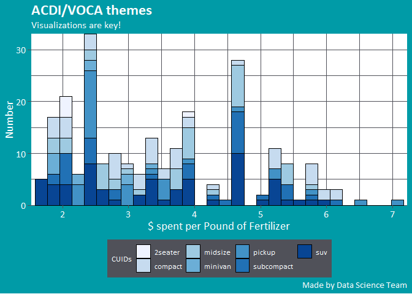
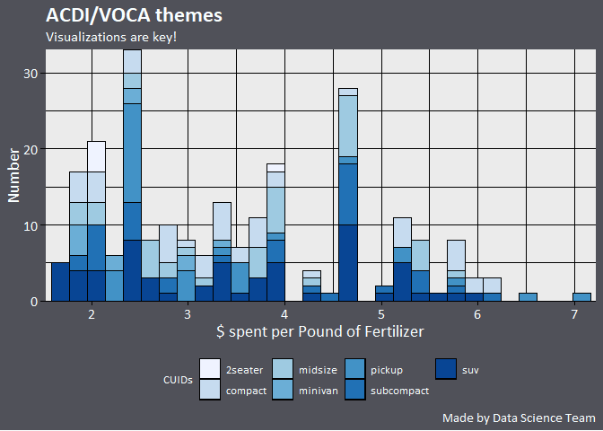

<!-- README.md is generated from README.Rmd. Please edit that file -->

``` r
library(extrafont)
library(ggplot2)
library(dplyr)
library(AVthemes)
```

# AVthemes

The goal of AVthemes is to …

## Installation

You can install the released version of AVthemes from
[CRAN](https://CRAN.R-project.org) with:

``` r
install.packages("AVthemes")
```

## Example

This is a basic example which shows you how to solve a common problem:

``` r
## basic example code
mpg %>% 
  ggplot(aes(displ)) +
  geom_histogram(aes(fill = rev(class)), col = "black", size = 0.1) +
  scale_x_continuous(expand = c(0.01, 0)) +
  scale_y_continuous(expand = c(0, 0)) +
  scale_fill_brewer(name = "CUIDs") +
  labs(title = "ACDI/VOCA themes",
       subtitle = "Visualizations are key!",
       x = "$ spent per Pound of Fertilizer", y = "Number",
       caption = "Made by Data Science Team") +
    theme_AV(ticks = TRUE)
#> `stat_bin()` using `bins = 30`. Pick better value with `binwidth`.
```



``` r
mpg %>% 
  ggplot(aes(displ)) +
  geom_histogram(aes(fill = rev(class)), col = "black", size = 0.1) +
  scale_x_continuous(expand = c(0.01, 0)) +
  scale_y_continuous(expand = c(0, 0)) +
  scale_fill_brewer(name = "CUIDs") +
  labs(title = "ACDI/VOCA themes",
       subtitle = "Visualizations are key!",
       x = "$ spent per Pound of Fertilizer", y = "Number",
       caption = "Made by Data Science Team") +
    theme_AVgray(ticks = TRUE)
#> `stat_bin()` using `bins = 30`. Pick better value with `binwidth`.
```


