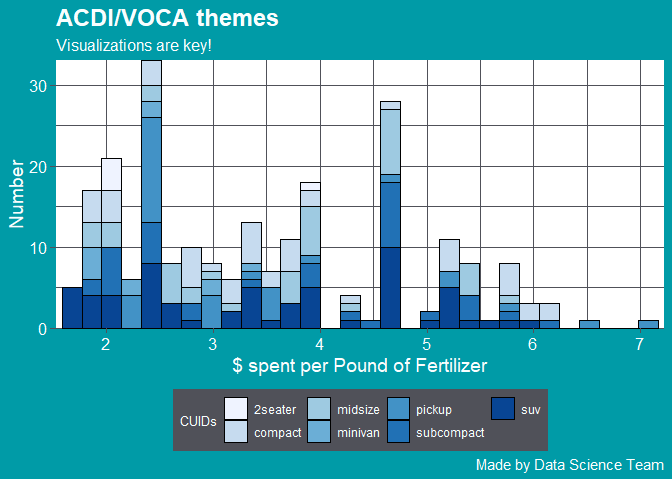

<!-- README.md is generated from README.Rmd. Please edit that file -->
<!-- badges: start -->

[](https://www.tidyverse.org/lifecycle/#experimental)
<!-- badges: end -->

# ACDIVOCAthemes

ACDIVOCAthemes packages contains color palette and `ggplot2` theme based
on international development NGO ACDI/VOCA’s colors.

## Installation

You can install the released version of AVthemes from Github with:

``` r
# install.packages("devtools")
devtools::install_github("ACDIVOCATech/ACDIVOCAthemes")
```

## Example

``` r
library(extrafont)
library(ggplot2)
library(dplyr)
library(ACDIVOCAthemes)
```

### `theme_AV()`

``` r
## basic example code
mpg %>% 
  ggplot(aes(displ)) +
  geom_histogram(aes(fill = rev(class)), col = "black", size = 0.1) +
  scale_x_continuous(expand = c(0.01, 0)) +
  scale_y_continuous(expand = c(0, 0)) +
  scale_fill_brewer(name = "CUIDs") +
  labs(title = "ACDI/VOCA themes",
       subtitle = "Visualizations are key!",
       x = "$ spent per Pound of Fertilizer", y = "Number",
       caption = "Made by Data Science Team") +
  theme_AV(ticks = TRUE)
#> `stat_bin()` using `bins = 30`. Pick better value with `binwidth`.
```



### `theme_AVgray`

``` r
mpg %>% 
  ggplot(aes(displ)) +
  geom_histogram(aes(fill = rev(class)), col = "black", size = 0.1) +
  scale_x_continuous(expand = c(0.01, 0)) +
  scale_y_continuous(expand = c(0, 0)) +
  scale_fill_brewer(name = "CUIDs") +
  labs(title = "ACDI/VOCA themes",
       subtitle = "Visualizations are key!",
       x = "$ spent per Pound of Fertilizer", y = "Number",
       caption = "Made by Data Science Team") +
  theme_AVgray(ticks = TRUE)
#> `stat_bin()` using `bins = 30`. Pick better value with `binwidth`.
```


